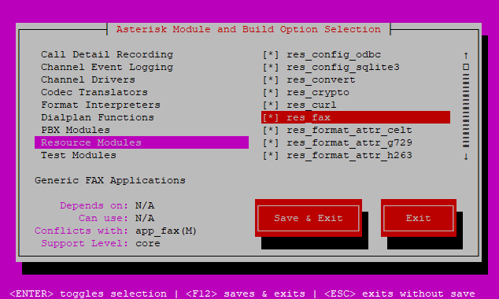
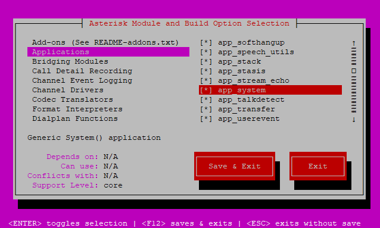

# Compiling Asterisk with the fax module and sytem application
When compiling Asterisk, you may need to explicitly enable the res_fax resource module and the app_system application.
To do this, at the `make menuselect` stage, enter the `Resource Modules` category and ensure that `res_fax` is checked and enter the `Applications` section and ensure that `app_system` is checked.



# Loading the modules on Asterisk startup
Locate the `; Resources` section in your `/etc/asterisk/modules.conf` file and add the following information to the end of the section.
```
load = res_fax.so
load = res_fax_spandsp.so
```

Locate the `; Applications` section in your `/etc/asterisk/modules.conf` file and add the following information to the end of the section.
```
load = app_system.so
```

Restart Asterisk and ensure that `app_system.so`, `res_fax.so` and `res_fax_spandsp.so` is Running.
You can do this by running `asterisk*CLI> module show`.

Ensure that the Spandsp driver is a registered fax technology module.
You can do this by running `asterisk*CLI> fax show capabilities`.

You now have the ability to use `app_system`, `res_fax` and `res_fax_spandsp`.
These modules and applications will allow you to send/receive faxes and execute system commands from the dialplan.
